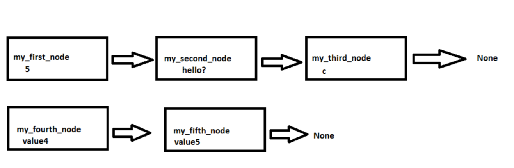

The Node
=====================
Introduction
------------------------------
Think about a structure like a building, or those Stonehenge in the UK, the thing that makes them impressive and memorable is that they are a sequence of things that put together, create the impressive structure we see, it's not just one stone alone laying in the field what seems impressive to our eyes, but the fact that there are many stones, and they are arranged in a very peculiar way. 

Now read the last paragraph and replace "impressive and memorable" with useful and you have a pretty close definition of what a Data structure in the sense of computer science is. Data structure is basically data put together in a sequential way (same way as when you build a house, you know where the roof goes and where the floor goes) that serves a purpose of being able to eventually use that data for something. In this same definition, a node is like a brick on a house, the node is then part of the structure, many nodes form the structure, and the node needs to be created too so that we can put them together to form a structure. We have to create them in a way that we can know which is the first and last node, and everything in between.

Big picture of a Node in a Data Structure scheme
------------------------------
To get a big picture of how to create and use nodes, I suggest thinking about two categories, each one has it's own set of instructions :
* Create the nodes
* Link the nodes together

To accomplish "1. Create the nodes"
------------------------------
- Build the machinery to create the Nodes:
	- Create a class named Node
	- Force the class (by the use of a constructor) to initialize a Node object with a value
	- You may leave the Node link to other nodes pointing to null, this will be like creating bricks, but not gluing them together yet.
- Create the Nodes
	- Use the Node class to initialize Nodes with it's values

In Python:
<br>
<br>
Code Node1.1
```
class Node:
  def __init__(self, value, link_to_next_node=None):
    self.value = value
    self.link_to_next_node = link_to_next_node
```

Explanation :
<br>
Node1.1 code snippet uses a constructor to take an argument "value", which is required. Then we take another argument which is optional (since we are initializing it already in the constructor's signature)
<br>
<br>
The previous example, has helped us create a single node. If you are a reader of this blog, and you have no idea what self is, or what __init__ or a constructor is, I suggest you do any of the following two things :

1. Just think that you are a constructor worker who's duty is to learn how to create bricks. You don't have to understand the machine that makes bricks, you just have to learn how to use it.
2. Learn some python and come back


Now let's create a few Nodes. The Nodes will contain values, remember that the purpose of a Node is to be used eventually in a data structure and data structures need to have data !


code Node1.2
```
my_first_node = Node(5)
my_second_node = Node("hello?")
my_third_node = Node('c')
```

    Note that we are creating this node with just a single value, leaving the "link_to_next_node" variable null (equals to None)

We can create Nodes with links to other Nodes from their creation like this (like bricks, glued to other bricks) :

To accomplish "2. Link the nodes together"
------------------------------
- Use the constructor to create Nodes with links between each other from scratch
- also, create getters and setter methods to be able to add links between the nodes once they were created.
	- By using getters and setters, we can set a value to the link_to_next_node=None variable we had created as an argument on the constructor. 
		- By saying my_first_node.set_link_to_next_node(my_second_node) we add an unbreakable (not really) reference between them, sort of like the Titanic movie, Rose had a chance to let Jack on the door, but instead she let him freeze and broke the bond (which would equal saying my_first_node.set_link_to_next_node(None)

code Node 2.1
```
my_fifth_node = Node("value5")
my_fourth_node = Node("value4", my_fifth_node)
```


Conceptually, now my_fourth_node and my_third_node are sort of glued together, forming a simple data structure of two nodes. For now, we won't explore the intricate details on how to verify that, or what value does that have in writing a program. 


Now that we learned how to create these Node/bricks as a standalone Node and also create them already linked to another node, let's go through the "gluing standalone Nodes together" phase, as just having isolated nodes is as useful as having bricks, we have to use them in a structure for them to have a purpose of existing! 

To glue them together, we have to go back to our class Node and give our brick creating machine the ability to spill out some cement (or whatever thing you prefer to use for construction), we do that by using methods getters and setters to modify the Nodes objects we instantiated 


code Node 2.2
```
class Node:
  def __init__(self, value, link_to_next_node=None):
    self.value = value
    self.link_to_next_node = link_to_next_node

  def set_link_to_next_node(self, link_to_next_node):
      self.link_to_next_node = link_to_next_node

  def get_link_to_next_node(self):
      return self.link_to_next_node

  def get_value(self):
     return self.value
```

<br>
<br>
<br>
Through getters and setters, we can now grab our previous standalone instances of Node and put them together to form something like the following picture
```
my_first_node.set_link_to_next_node(my_second_node)
my_second_node.set_link_to_next_node(my_third_node)
my_third_node.set_link_to_next_node(my_fourth_node)
```



How would we check the validity of this? 
Let's print the values of each node to the screen first. To do this, let's go back to the Node class and let's add a getter method

<br>
<br>
Node 2.4
```
print(my_first_node.get_value())
print(my_second_node.get_value())
print(my_third_node.get_value())
print(my_fourth_node.get_value())
print(my_fifth_node.get_value())
```

This will print this out to the screen
5
hello?
c
value4
value5

Now, what about testing if the nodes are REALLY GLUED TOGETHER?
To do that, we can say :
Ok my_first_node, if you are really glued together to my_second_node, I want you to tell me his value
```
print(my_first_node.get_link_to_next_node().get_value())
```

This prints 
"hello"

which means we do have a link between the two !

If you try to do the same thing on my_fifth_node (get the next node) you get an errror similar to :

```
Traceback (most recent call last):
  File 
"/name/of/your/dir/venv/NodeTest.py", line 36, in <module>
    testing_node4_link = my_fifth_node.get_link_to_next_node().get_value()
AttributeError: 'NoneType' object has no attribute 'get_value'
```

which means that there is no next node, since it's pointing to "None" (null) as depicted in the diagram above.