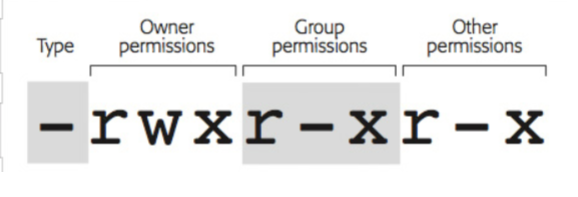

CHOWN vs CHMOD
-------------

The short explanation is that "chown" changes who owns a file and "chmod" changes who can read, write or execute a file. A rather simple topic, but the interesting part comes when, during an interview or a casual conversation, you get asked with practical applications of each one, and why it would be better to use one over the other under certain circumstances.

First off, let's start by talking about the meta data of a file

when you do ls -l in UNIX, you get the meta data of a file, it looks something like this :




x meta data tells us who can read, write or execute a file and although more details about this are out of the scope of this tutorial, i thought it was a good introduction to the following. See the picture above to find who can do what on 

in which situations will chown come handy?
Mainly, if you want to give permissions to a user of writing, reading and executing a file, but you don't want him to be able to change those permission himself

remember that chown acts in the following manner : 

```
chown [OPTION]... [OWNER][:[GROUP]] FILE...
```

so doing something like this :

```
sudo chown -R $(id -u):$(id -g) mydir
```

will mean that 
we want to change owner recursively on app-modules folder and everything inside of it no matter the depth
then we encapsulate the id -u to get the current user id, and the id of the group, becuase our chown command goes as : 
owner:group

```
chown -R $(id -u):$(id -g) .ssh
```